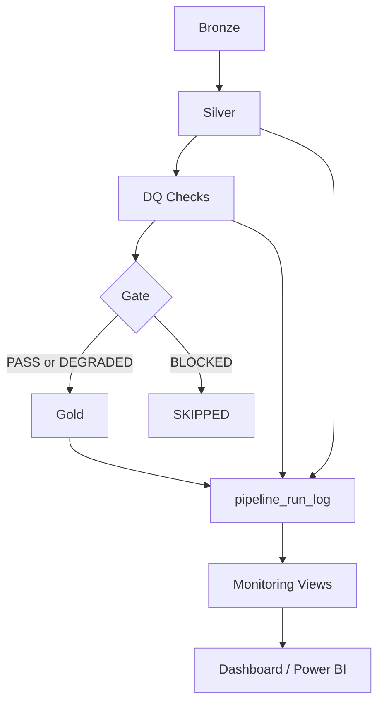
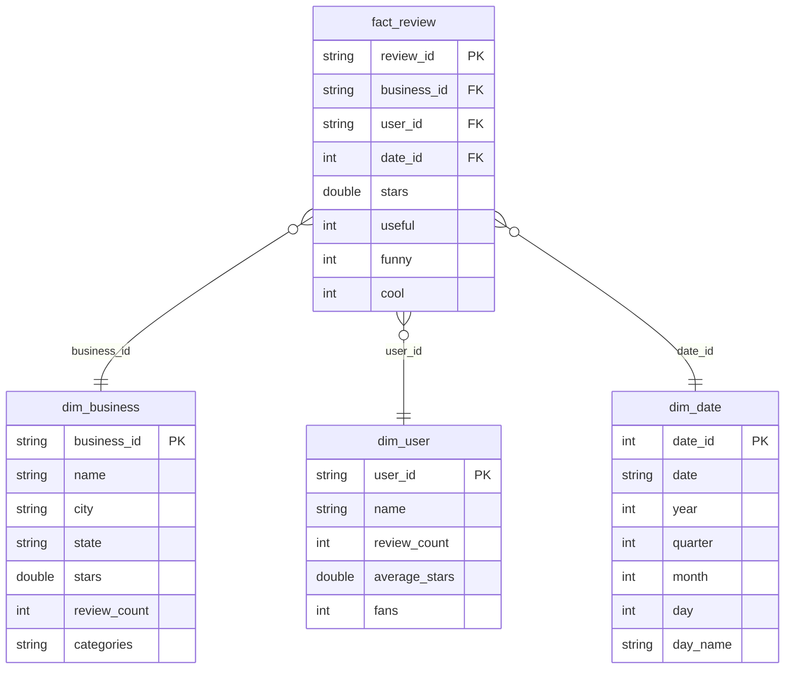

# Yelp Lakehouse Data Engineering Pipeline
#### (Bronze → Silver → DQ → Gold → Monitoring)

A production-style Lakehouse data pipeline built with Spark and Delta Lake on Microsoft Fabric, implementing Medallion architecture (Bronze → Silver → Gold), a custom data quality framework with severity-based gating, and pipeline observability through structured run logging.

---

## Architecture



- **Bronze**: raw ingestion with metadata (`_ingest_ts`, `_source_file`, `_batch_id`)
- **Silver**: cleaned schema, type casting, deduplication, quality filters
- **DQ**: rule-based checks with severity gating → `dq_rule_result`, `dq_table_gate`
- **Gold**: curated aggregates for analytics and BI
- **Monitoring**: run log + 7-day rolling views for reliability, SLA, and health scoring

### Star Schema (Gold layer)

The Gold layer is modelled as a star schema. `fact_review` sits at the center, joined to three dimension tables on `business_id`, `user_id`, and `date_id`.



---

## Tech Stack

| Category | Tools |
|----------|-------|
| Data Processing | Apache Spark (PySpark), Spark SQL |
| Storage | Delta Lake, Microsoft Fabric Lakehouse |
| Data Quality | Custom rule engine with severity-based gating |
| Observability | Pipeline run logging, monitoring views |
| Language | Python, SQL |
| Platform | Microsoft Fabric (Synapse PySpark) |

---

## Repository Structure

```
Yelp-data-engineering/
├── 01_bronze_ingest/
│   ├── 01_0_bronze_run_all.ipynb
│   ├── 01_1_bronze_business.ipynb
│   ├── 01_2_bronze_review.ipynb
│   ├── 01_3_bronze_checkin.ipynb
│   ├── 01_4_bronze_user.ipynb
│   └── 01_5_bronze_tip.ipynb
├── 02_silver_conform/
│   ├── 02_0_silver_run_all.ipynb
│   ├── 02_1_silver_business.ipynb
│   ├── 02_2_silver_review.ipynb
│   ├── 02_3_silver_checkin.ipynb
│   ├── 02_4_silver_user.ipynb
│   └── 02_5_silver_tip.ipynb
├── 03_dq_framework/
│   ├── 03_0_dq_init_tables.ipynb
│   ├── 03_1_dq_rule_engine.ipynb
│   ├── 03_1_1_dq_rule_config.ipynb
│   └── 03_2_dq_silver_run_all.ipynb
├── 04_gold_marts/
│   ├── 04_1_gold_fact_review.ipynb
│   ├── 04_2_gold_dim_business.ipynb
│   ├── 04_3_gold_dim_user.ipynb
│   ├── 04_4_gold_dim_date.ipynb
│   ├── 04_5_gold_business_metrics.ipynb
│   ├── 04_6_gold_city_metrics.ipynb
│   └── 04_7_run_gold_pipeline.ipynb
├── docs/
│   ├── schema.md
│   └── monitoring.md
└── environment.md
```

---

## How to Run

1. **Bronze**: run `01_0_bronze_run_all`
2. **Silver**: run `02_0_silver_run_all`
3. **DQ**: run `03_2_dq_silver_run_all`
4. **Gate decision**:
   - BLOCKED / SKIPPED → pipeline stops, logs written
   - PASS / DEGRADED → proceed to Gold
5. **Gold**: run `04_7_run_gold_pipeline`

See [`environment.md`](./environment.md) for platform and runtime requirements.
See [`docs/schema.md`](./docs/schema.md) for table contracts.
See [`docs/monitoring.md`](./docs/monitoring.md) for observability framework details.

---

## Acknowledgements

- **Yelp Dataset**: This project uses the [Yelp Open Dataset](https://www.yelp.com/dataset), kindly made available by Yelp Inc. for academic and personal learning purposes.
- **Microsoft Fabric**: Pipeline development and execution were carried out using [Microsoft Fabric](https://www.microsoft.com/en-us/microsoft-fabric), including its Lakehouse, Spark runtime, and notebook environments.

---

## Disclaimer

This project is built solely for **personal learning purposes**, with the goal of exploring data engineering concepts and Microsoft Fabric product components. It is not intended for commercial use. All data used in this project is publicly available and used in accordance with the Yelp Dataset Terms of Use.
