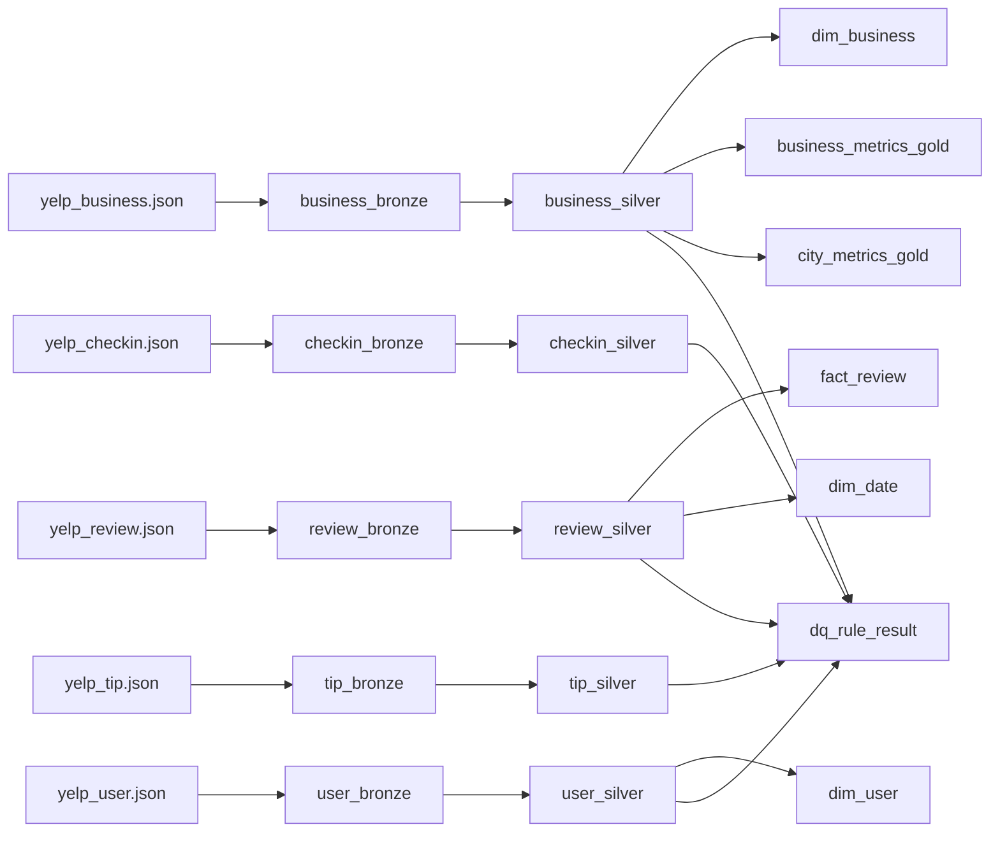
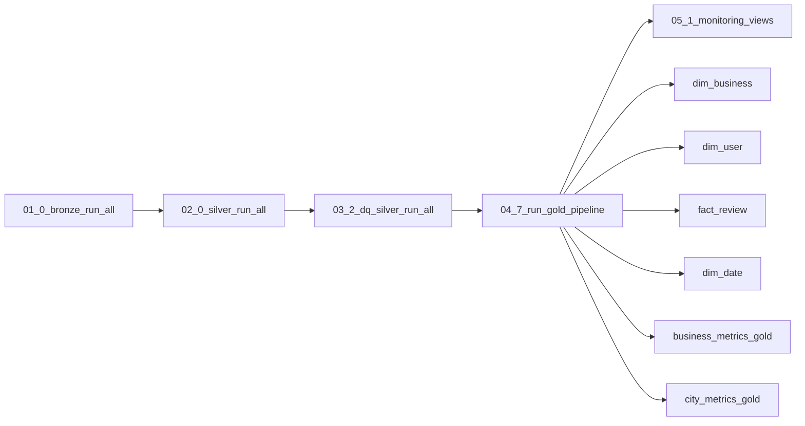

# Data Lineage

## Table Lineage

```mermaid
graph LR
  raw_business[yelp_business.json] --> business_bronze
  raw_review[yelp_review.json] --> review_bronze
  raw_checkin[yelp_checkin.json] --> checkin_bronze
  raw_user[yelp_user.json] --> user_bronze
  raw_tip[yelp_tip.json] --> tip_bronze

  business_bronze --> business_silver
  review_bronze --> review_silver
  checkin_bronze --> checkin_silver
  user_bronze --> user_silver
  tip_bronze --> tip_silver

  business_silver --> dim_business
  user_silver --> dim_user
  review_silver --> fact_review
  review_silver --> dim_date
  business_silver --> business_metrics_gold
  business_silver --> city_metrics_gold

  business_silver --> dq_rule_result
  review_silver --> dq_rule_result
  checkin_silver --> dq_rule_result
  user_silver --> dq_rule_result
  tip_silver --> dq_rule_result
```

## Notebook Lineage

```mermaid
graph LR
  nb1[01_0_bronze_run_all] --> nb2[02_0_silver_run_all]
  nb2 --> nb3[03_2_dq_silver_run_all]
  nb3 --> nb4[04_7_run_gold_pipeline]
  nb4 --> nb5[05_1_monitoring_views]

  nb4 --> dim_business
  nb4 --> dim_user
  nb4 --> fact_review
  nb4 --> dim_date
  nb4 --> business_metrics_gold
  nb4 --> city_metrics_gold
```