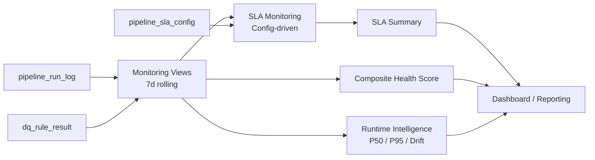

# Monitoring & Observability

This document describes the monitoring framework built on top of the pipeline execution logs.

---

## Overview

All pipeline runs are recorded in `pipeline_run_log`, and data quality results are persisted in `dq_rule_result` and `dq_table_gate`.

Monitoring views aggregate these logs using a **7-day rolling window** to provide structured operational visibility.



---

## Execution Semantics

Pipeline execution outcomes are explicitly categorized:

| Status | Meaning |
|--------|---------|
| SUCCESS | Pipeline executed successfully |
| DEGRADED | Pipeline executed with acceptable DQ risk |
| BLOCKED | Execution prevented due to CRITICAL DQ failure |
| SKIPPED | Pipeline intentionally not executed (e.g., upstream Gate BLOCKED) |
| FAILED | Pipeline terminated due to runtime or system errors |

SKIPPED is treated as a first-class state to avoid false failure alerts.

---

## Success Rate Semantics

Two success rate metrics are provided:

**1) Excluding SKIPPED** — reflects true execution reliability
```sql
Success Rate = SUCCESS / NULLIF((TOTAL - SKIPPED), 0)
```
Returns NULL if all runs are SKIPPED, to avoid misleading 0% values.

**2) Including SKIPPED** — reflects overall pipeline experience
```sql
Success Rate = SUCCESS / TOTAL
```

---

## Runtime Intelligence

Monitoring views track runtime behavior to detect gradual degradation:

- **P50** – median execution time
- **P95** – tail latency indicator
- **Average duration**
- **Runtime drift** – 3-day vs 7-day comparison

This enables detection of performance issues even when pipelines are still succeeding.

---

## SLA Monitoring (Config-Driven)

SLA thresholds are externalized into `pipeline_sla_config` rather than hardcoded, enabling:
- Dynamic SLA updates without modifying monitoring logic
- Different thresholds per pipeline
- Future support for environment-specific configurations

SLA compliance is evaluated via:
- `v_monitor_sla_7d`
- `v_monitor_sla_summary_7d`

---

## Composite Health Score

A weighted health score (0–100) integrates multiple signals:

| Signal | Weight |
|--------|--------|
| Execution reliability (success rate) | 40% |
| SLA compliance | 30% |
| Blocked frequency | 20% |
| Critical DQ failures | 10% |

Each pipeline receives a health classification:

| Score | Classification |
|-------|---------------|
| 80–100 | HEALTHY |
| 60–79 | WARNING |
| 0–59 | CRITICAL |

---

## Operational Actionability

| State | What it surfaces |
|-------|-----------------|
| FAILED | Error context for debugging |
| SKIPPED | Explicit skip reason |
| BLOCKED | Upstream DQ issue details |
| SLA breach | Performance risk alert |
| Critical DQ failure | Prioritized for remediation |

The monitoring layer is modular and extensible — additional metrics can be added without altering pipeline execution logic.
